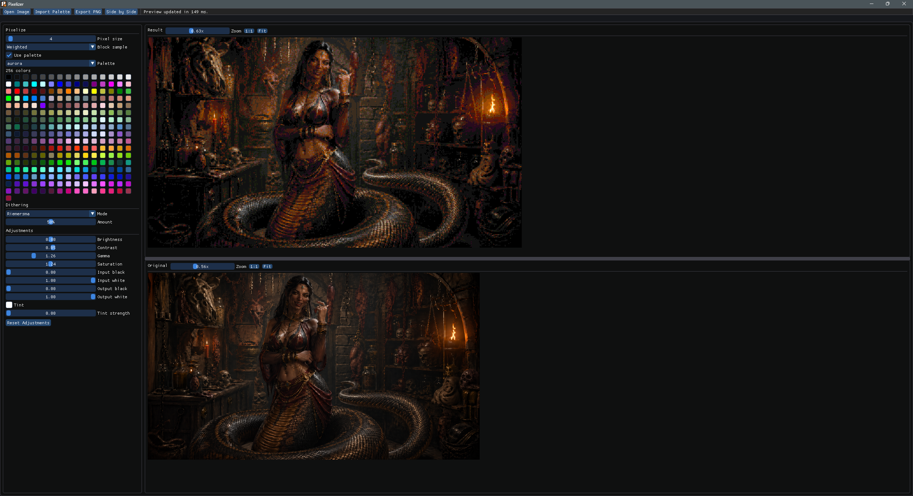
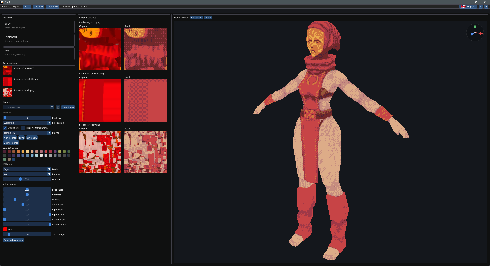

#  Pixelizer

[](https://github.com/vorvek/Pixelizer/actions/workflows/release.yml)

Pixelizer is a desktop texture tool for turning images and 3D model textures into pseudo-pixel art. It runs on Windows, Linux, and macOS, and is written in C++20 with SDL3, OpenGL, and Dear ImGui.

| Image workflow | 3D model texture workflow |
| --- | --- |
|  |  |

## What It Does

Pixelizer keeps the editing loop simple: import an asset, tune the pixelization, palette, dithering, and adjustment controls, preview the result live, then export the processed output.

It supports standalone images and model texture workflows:

- Images: PNG, JPG/JPEG, BMP, TGA, GIF, WebP, JPEG XL, QOI, TIFF, and PNM/PPM/PGM/PBM.
- 3D models: GLB, glTF, OBJ, FBX, and DAE.
- Palettes: Lospec `.hex` files, bundled default palettes, and custom palettes made in the app.

## Image Workflow

Image imports behave like the earlier Pixelizer workflow. The app shows a result viewport by default, with optional two-view layouts for comparing the original and processed image.
Imports decode to a single flattened image; animated imports are treated as still images for now, and imported alpha is simplified to binary transparency.

Features include:

- Block pixelization with linear-light averaging.
- Palette mapping or per-channel color reduction.
- Ordered dithering, blue-noise dithering, error diffusion, Riemersma dithering, clustered-dot patterns, and directional patterns.
- Brightness, contrast, gamma, levels, saturation, and tint controls.
- Undo and redo for processing edits.
- Independent zoom for original and result previews.
- Direct numeric entry by double-clicking numeric controls.

## 3D Model Texture Workflow

Model imports switch Pixelizer into model mode. GLB, glTF, OBJ, FBX, and DAE files are loaded into an unshaded OpenGL preview so the processed textures can be checked directly on the mesh.

In model mode:

- The left sidebar shows a material list and a texture drawer.
- Models with no assigned textures render with a flat grey material.
- Imported images are added to the texture drawer instead of replacing the model.
- Textures can be dragged from the drawer onto materials.
- The same pixelization, palette, adjustment, and dithering controls apply to every assigned diffuse/base-color texture together.
- The original viewport shows a gallery of source textures.
- The working viewport shows the processed model preview.

Pixelizer currently processes diffuse/base-color textures only. Normal, metallic, roughness, occlusion, and other data maps are left untouched.

## Controls

The in-app help button next to the language selector lists the active controls. The main shortcuts are:

- `Ctrl+Z`: undo.
- `Ctrl+Shift+Z`: redo.
- `Ctrl+mouse wheel` over an image viewport: zoom the image.
- Left drag over the model preview: orbit.
- Middle drag, right drag, or `Shift+left drag` over the model preview: pan.
- Mouse wheel over the model preview: zoom.
- `Reset view`: fit the camera around the model.
- `Origin`: center the model preview around world `0,0,0`.

## Exporting

`Export... > Export PNG` adapts to the current workflow:

- In image mode, it exports the processed image.
- In model mode, it exports the processed model textures only, prompting once per affected texture.

PNG export writes indexed 8-bit PNGs when the result fits in 256 palette entries, and truecolor PNGs otherwise.

`Export... > Export Raw` is available for images. It writes an 8-bit indexed `.raw` file, a shared `.pal` palette sidecar, and an optional `.msk` transparency mask.

## Downloads

Download the latest release from the [Releases page](https://github.com/vorvek/Pixelizer/releases).

## Build From Source

Pixelizer uses CMake presets and fetches its libraries at configure time.

### Windows

```powershell
cmake --preset ninja-release
cmake --build --preset ninja-release
.\build\ninja-release\pixelizer.exe
```

### Linux

Install SDL build dependencies first. On Ubuntu:

```bash
sudo apt-get install build-essential cmake git ninja-build pkg-config \
  libasound2-dev libdbus-1-dev libdecor-0-dev libegl1-mesa-dev \
  libgl1-mesa-dev libgles2-mesa-dev libibus-1.0-dev libpipewire-0.3-dev \
  libpulse-dev libudev-dev libwayland-dev libx11-dev libxcursor-dev \
  libxext-dev libxfixes-dev libxi-dev libxkbcommon-dev libxrandr-dev \
  libxss-dev libxtst-dev wayland-protocols
cmake --preset ninja-release
cmake --build --preset ninja-release
./build/ninja-release/pixelizer
```

### macOS

```bash
brew install cmake ninja
cmake --preset ninja-release
cmake --build --preset ninja-release
./build/ninja-release/pixelizer
```

## Raw Export Format

Raw export writes a headerless 8-bit indexed image plus sidecar files:

- `<image>.raw` contains exactly `width * height` bytes in row-major order, left-to-right and top-to-bottom. Each byte is a palette index from `0` to `255`.
- `<palette>.pal` contains the shared palette. If a saved palette is active, the sidecar is named from that palette, so multiple raw images can share one palette file. If there is no saved active palette, it uses the exported image stem. The file is ASCII text with one uppercase `RRGGBB` color per line; the line number is the palette index.
- `<image>.msk` is written only when the result contains transparent pixels. It contains `ceil(width * height / 8)` bytes in the same pixel order. Bits are packed most-significant-bit first within each byte. A `1` bit means transparent; a `0` bit means opaque. For transparent pixels, the corresponding `.raw` index byte is `0` and should be ignored.

Pixelizer raw export supports up to 256 opaque palette colors plus binary transparency. It does not store width or height in the files, so projects should keep dimensions in their own asset metadata.

For pixel `i = y * width + x`:

```c
uint8_t index = raw[i];
bool transparent = mask && (mask[i / 8] & (0x80 >> (i & 7)));
```

## Dependencies

The build statically links SDL3 `release-3.4.4`, SDL_image `release-3.4.2`, Dear ImGui `v1.92.7`, stb image libraries, tinygltf `v2.9.7`, tinyobjloader `v2.0.0rc13`, ufbx `v0.21.3`, and tinyxml2 `11.0.0`. See [THIRD_PARTY.md](THIRD_PARTY.md) for license notes.

## License

Pixelizer is released under the [MIT License](LICENSE).
